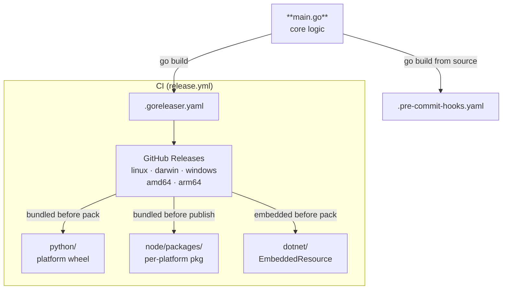

# Contributing

## Architecture

The Go binary at the repo root is the single source of truth. Every other sub-project is a thin wrapper that ships that binary inside its package.



Each wrapper runs the bundled binary directly, no PATH lookup, no download, no fallback. If the bundled binary isn't present (e.g. an unsupported platform, or `npm install --no-optional`), the wrapper errors out and tells the user to reinstall. The pre-commit hook bypasses bundling entirely and compiles from source via the Go toolchain it manages itself.

## Supported runtime versions

Each version pin in this repo ([`go.mod`](go.mod), [`pyproject.toml`](python/pyproject.toml), [`clang-format-swig.csproj`](dotnet/clang-format-swig.csproj), [`node/package.json`](node/package.json)) records what the source actually requires, with the rationale inline.

- **Must** support every non-EOL version of each ecosystem we target, dropping one is a regression.
- **May** bump the floor when a new language or library feature is worth it; update the pin's inline comment in the same change.
- Otherwise keep the supported range as wide as possible, including EOL'd versions when the code happens to still work on them. Lowering the floor costs us nothing.

## Local development

You will need the following tools to be able to install all dev dependencies and run everything:

- [Go](https://go.dev/doc/install)
- [uv](https://docs.astral.sh/uv/getting-started/installation/) (Don't forget you can get [Shell autocompletion](https://docs.astral.sh/uv/getting-started/installation/#shell-autocompletion))
- [Node](https://nodejs.org/en/download)
- [.NET](https://dotnet.microsoft.com/en-us/download)
- `clang-format` must be installed separately and be on `PATH`. Install it however you'd normally get LLVM tooling on your platform (e.g. `apt install clang-format`, `brew install clang-format`, `winget install LLVM.LLVM`, `uv tool install clang-format`, `npm install -g clang-format`, ...).
<!-- Keep clang-format message above in sync with README.md -->

```sh
# Build and run directly
go run . --check path/to/file.i

# Run unit + integration tests
go test ./...
```

To test a wrapper end-to-end, build the binary into the location that wrapper expects to ship it, there's no PATH fallback. For example, the Python wrapper:

```sh
go build -o python/src/clang_format_swig/_bin/clang-format-swig .
cd python && uv run clang-format-swig --check path/to/file.i
```

The Node wrapper expects it at `node/packages/<platform>/clang-format-swig`; the .NET wrapper requires `dotnet pack` so the binary is embedded as a resource.

## Releasing

The git tag is the single source of truth for the version number. Every distribution derives from it at build time, so no version strings in the repo need editing before tagging:

- **Go binary** — goreleaser injects the version via `-ldflags`.
- **Python wheel** — hatch-vcs reads it from the tag (see [`pyproject.toml`](python/pyproject.toml)).
- **npm packages** — CI runs `npm version "$VERSION"` against the placeholder `0.0.0` in [`node/**/package.json`](node/package.json).
- **NuGet package** — CI invokes `dotnet pack -p:Version=...` with the tag.

### Tag and push

```sh
git tag vX.X.X
git push origin --tags
```

This triggers [`release.yml`](.github/workflows/release.yml), which:

- Runs **goreleaser** > builds binaries for all platforms > creates the GitHub Release
- Downstream jobs then download those binaries and publish to their respective registries

### Go module proxy

No action required beyond the tag. The Go module proxy indexes new tags automatically; `go install github.com/Avasam/clang-format-swig@latest` starts working as soon as the tag is live.
